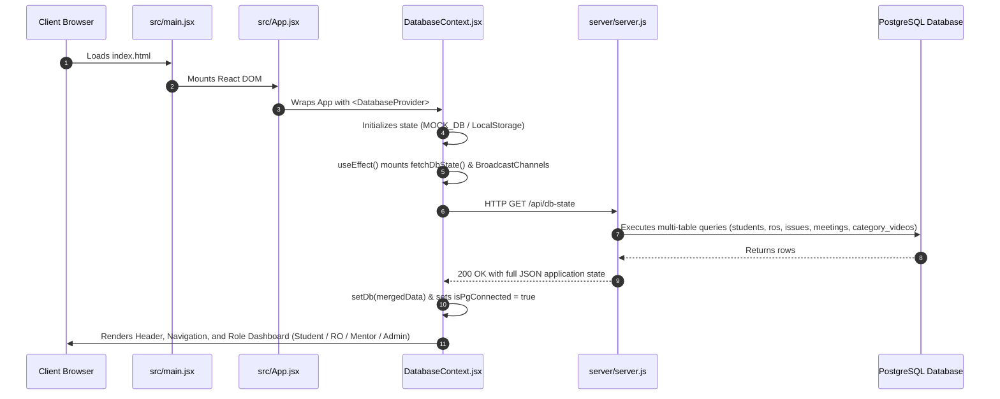
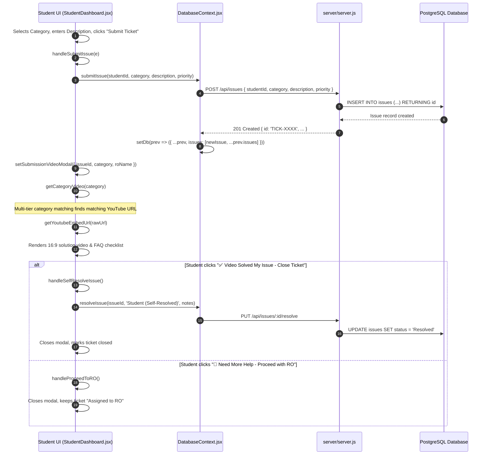
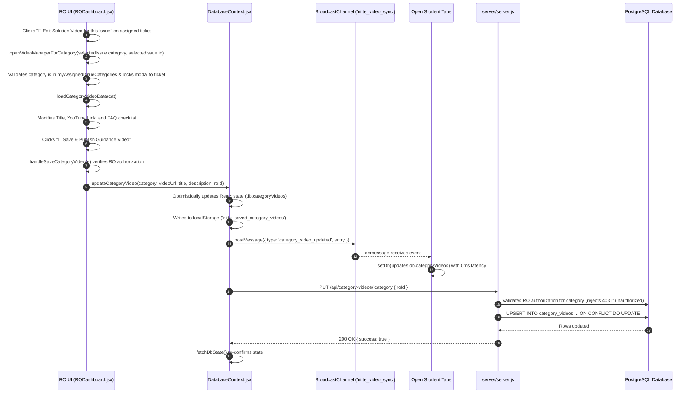
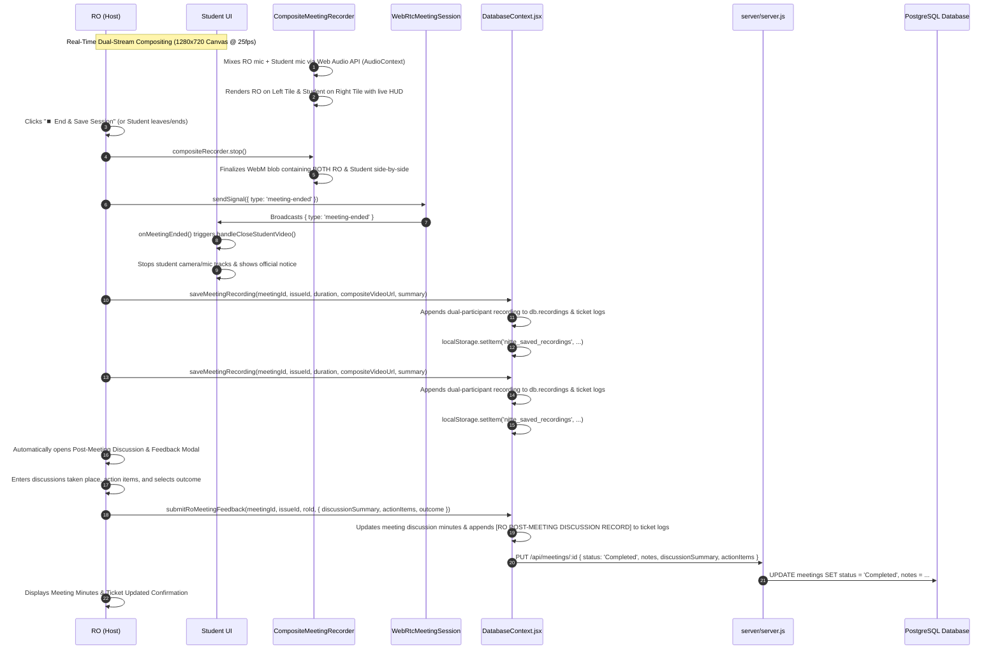
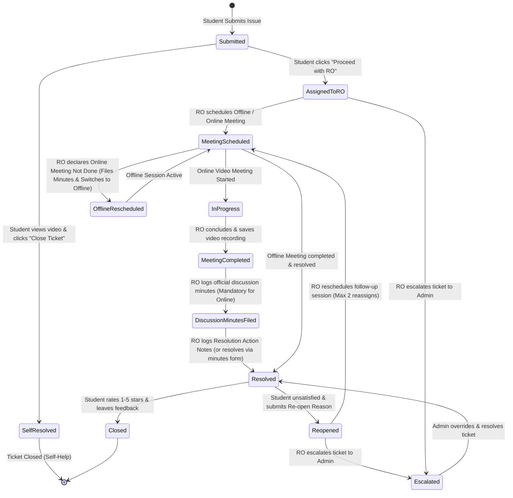

# 🔄 System Execution Flow & Call Hierarchy (flow.md)

This document maps the end-to-end execution flow of the **NITTE Mentorship & Grievance Redressal System**. It specifies the exact entry points, functions called, API endpoints hit, data mutations, signaling mechanisms, and termination end points across the key modules.

---

## 📑 Table of Contents
1. [Application Startup & State Synchronization Flow](#1-application-startup--state-synchronization-flow)
2. [Student Issue Submission & Guidance Video Flow](#2-student-issue-submission--guidance-video-flow)
3. [RO Guidance Video Management & Real-Time Sync Flow](#3-ro-guidance-video-management--real-time-sync-flow)
4. [Online Video Meeting Scheduling, Joining & WebRTC Handshake Flow](#4-online-video-meeting-scheduling-joining--webrtc-handshake-flow)
5. [Host-Driven Meeting Termination & Session Auto-Recording Flow](#5-host-driven-meeting-termination--session-auto-recording-flow)
6. [Ticket Lifecycle State Transition Flow](#6-ticket-lifecycle-state-transition-flow)

---

## 1. Application Startup & State Synchronization Flow



### Detailed Function Call Trace:
1. **Entry Point**: `src/main.jsx` invokes `ReactDOM.createRoot().render(<App />)`.
2. **Context Setup**: `src/App.jsx` mounts `<DatabaseProvider>` from `src/context/DatabaseContext.jsx`.
3. **Database Bootstrap (Server)**:
   - `server/server.js` boots via `node server/server.js`.
   - Calls `initDb()` in `server/db.js`.
   - Runs `createTables()`: creates `students`, `mentors`, `ros`, `issues`, `meetings`, `category_videos`, etc.
   - Runs `seedTables()`: populates initial records if tables are empty.
4. **Client State Polling**:
   - `DatabaseContext.jsx` runs `fetchDbState()` on mount and sets up a `setInterval(fetchDbState, 3000)` polling cycle.
   - Also binds listeners for:
     - `new BroadcastChannel('nitte_meeting_sync')`
     - `new BroadcastChannel('nitte_video_sync')`
5. **End Point**: React state `db` is fully hydrated; role view is rendered based on `currentUser` (`StudentDashboard`, `RODashboard`, `MentorDashboard`, or `AdminDashboard`).

---

## 2. Student Issue Submission & Guidance Video Flow



### Detailed Function Call Trace:
1. **Entry Point**: Student clicks the "Submit Issue" button on the *Raise Issue* tab in `src/views/StudentDashboard.jsx`.
2. **Form Handler**:
   - Executes `handleSubmitIssue(e)`.
   - Validates description and weekly slot limits (`isFormLocked`).
3. **Context Dispatch**:
   - Calls `submitIssue(student.id, category, description, priority)`.
   - Sends `POST /api/issues` with payload.
   - Updates local `db.issues` state optimistically.
4. **Instant Video Modal Launch**:
   - Sets state `setSubmissionVideoModal({ issueId: newIssueId, category: submittedCategory, roName })`.
5. **Video Resolution Algorithm (`getCategoryVideo(cat)`)**:
   - Reads memory state and `localStorage.getItem('nitte_saved_category_videos')`.
   - **Tier 1**: Exact match on subcategory (`cat.toLowerCase() === v.category.toLowerCase()`).
   - **Tier 2**: Prefix match before `' - '` (e.g. `'Academic'` matches `'Academic'`).
   - **Tier 3**: Support Desk synonym match (e.g. `'Academic Support Desk'` matches `'Academic'`).
   - **Tier 4**: Substring containment match.
   - **Fallback**: Default system guide.
6. **YouTube URL Conversion (`getYoutubeEmbedUrl(url)`)**:
   - Parses watch URLs (`watch?v=...`), shortlinks (`youtu.be/...`), and shorts (`shorts/...`).
   - Extracts the 11-character video ID.
   - Outputs: `https://www.youtube-nocookie.com/embed/{id}?autoplay=1&rel=0`.
7. **End Point Actions**:
   - `handleSelfResolveIssue()` ➔ calls `resolveIssue()` ➔ marks ticket `Resolved` ➔ closes modal.
   - `handleProceedToRO()` ➔ ticket remains `Assigned to RO` ➔ navigates to `My Issues` view.

---

## 3. RO Guidance Video Management & Real-Time Sync Flow



### Detailed Function Call Trace:
1. **Entry Point**: RO clicks:
   - Ticket details: `openVideoManagerForCategory(selectedIssue.category, selectedIssue.id)` (Locked specifically to that assigned issue's category).
   - Sidebar: `openVideoManagerForCategory()` (Strictly constrained to `myAssignedIssueCategories`).
2. **Access Control & Data Prefill**:
   - `openVideoManagerForCategory` checks if target category is in `myAssignedIssueCategories`. If not, access is denied.
   - Sets `managerTargetIssueId` to lock the modal to that ticket.
   - Executes `loadCategoryVideoData(cat)` in `RODashboard.jsx`.
   - Sets form states: `managerVideoTitle`, `managerVideoUrl`, `managerVideoDesc`.
3. **Save Handler**:
   - Executes `handleSaveCategoryVideo(e)` upon clicking submit.
   - Verifies `myAssignedIssueCategories.includes(managerCategory)`.
   - Invokes `updateCategoryVideo(managerCategory, managerVideoUrl, managerVideoTitle, managerVideoDesc, ro.id)` from `DatabaseContext.jsx`.
4. **Backend Authorization Verification (`server/server.js`)**:
   - `PUT /api/category-videos/:category` verifies that the requesting `roId` matches the designated RO or has active tickets in that category. Rejects unauthorized attempts with `403 Forbidden`.
5. **Multi-Tab Broadcast Execution**:
   - Updates local state `setDb(prev => ({ ...prev, categoryVideos: merged }))`.
   - Persists to `localStorage.setItem('nitte_saved_category_videos', ...)`.
   - Dispatches broadcast:
     ```javascript
     const videoBc = new BroadcastChannel('nitte_video_sync');
     videoBc.postMessage({ type: 'category_video_updated', entry: updatedEntry });
     ```
   - In any other open tab (e.g. Student tab), `videoBc.onmessage` receives the entry and mutates state in **0 milliseconds**.
5. **Backend Persistence**:
   - Sends `PUT /api/category-videos/:category` with payload.
   - `server/server.js` runs PostgreSQL `ON CONFLICT (category) DO UPDATE`.
   - Synchronizes root department and `${dept} Support Desk` rows.
6. **End Point**: All current and future students submitting issues under this category view the new YouTube guidance video.

---

## 4. Online Video Meeting Scheduling, Joining & WebRTC Handshake Flow

```mermaid
sequenceDiagram
    autonumber
    participant RO as RO (Host)
    participant Student as Student (Peer)
    participant Relay as Express Signaling Relay (/api/meetings/signals)
    participant Google as Google STUN Servers

    Note over RO,Student: RO Schedules Meeting (Mode: Online)
    RO->>RO: handleOpenOnlineMeeting()
    RO->>RO: requestMedia() -> getUserMedia({ video: true, audio: true })
    RO->>RO: Starts MediaRecorder(stream) for session auto-recording
    RO->>RO: new WebRtcMeetingSession({ role: 'ro', localStream })
    RO->>RO: setupPeerConnection() with Google STUN

    Student->>Student: Clicks "Join Video Session"
    Student->>Student: requestStudentMedia() -> getUserMedia({ video: true, audio: true })
    Student->>Student: new WebRtcMeetingSession({ role: 'student', localStream })
    Student->>Relay: Sends 'ready' signal via BroadcastChannel & HTTP Relay

    RO->>RO: Receives 'ready' -> createOffer()
    RO->>RO: setLocalDescription(offer)
    RO->>Relay: Sends 'offer' signal
    Relay-->>Student: Relays 'offer' signal

    Student->>Student: setRemoteDescription(offer)
    Student->>Student: createAnswer() -> setLocalDescription(answer)
    Student->>Relay: Sends 'answer' signal
    Relay-->>RO: Relays 'answer' signal
    RO->>RO: setRemoteDescription(answer)

    par ICE Candidate Trickle
        RO->>Google: STUN NAT discovery
        Google-->>RO: Candidate discovered
        RO->>Relay: Sends 'candidate'
        Relay-->>Student: Relays 'candidate'
        Student->>Student: addIceCandidate()
    and
        Student->>Google: STUN NAT discovery
        Google-->>Student: Candidate discovered
        Student->>Relay: Sends 'candidate'
        Relay-->>RO: Relays 'candidate'
        RO->>RO: addIceCandidate()
    end

    Note over RO,Student: pc.ontrack triggers on both peers -> Tracks aggregated into persistent MediaStream -> Rendered via memoized VideoStreamPlayer with zero flicker!
```



### Detailed Function Call Trace:
1. **Meeting Launch (RO)**:
   - RO clicks "Start Video Call Session" in `src/views/RODashboard.jsx`.
   - Executes `handleLaunchOnlineMeeting()`.
   - Calls `requestMediaPermissions()`:
     ```javascript
     const stream = await navigator.mediaDevices.getUserMedia({
       video: { width: { ideal: 640 }, height: { ideal: 480 }, frameRate: { ideal: 30, max: 30 }, facingMode: 'user' },
       audio: { echoCancellation: true, noiseSuppression: true, autoGainControl: true }
     });
     ```
   - Instantiates memoized `<VideoStreamPlayer stream={localStream} muted={true} />`.
   - Starts recording: `new MediaRecorder(stream)` begins collecting chunks with relaxed 10s buffer.
   - Instantiates `webrtcSessionRef.current = new WebRtcMeetingSession({ role: 'ro', localStream: stream, ... })`.
2. **Meeting Join (Student)**:
   - Student clicks "Join Video Session" on their ticket in `src/views/StudentDashboard.jsx`.
   - Calls `requestStudentMedia()`.
   - Instantiates memoized `<VideoStreamPlayer stream={studentStream} muted={true} />`.
   - Instantiates `new WebRtcMeetingSession({ role: 'student', localStream: stream, ... })`.
3. **Signaling & SDP Audio Negotiation (`src/utils/webrtcService.js`)**:
   - `sendSignal({ type: 'ready' })` announces presence with unique `sessionId`.
   - RO creates SDP Offer: `pc.createOffer()` ➔ `tuneSdp()` (injects Opus FEC, minptime=10) ➔ `pc.setLocalDescription()` ➔ `sendSignal({ type: 'offer' })`.
   - Student receives offer: `pc.setRemoteDescription(offer)` ➔ `pc.createAnswer({ offerToReceiveAudio: true, offerToReceiveVideo: true })` ➔ `tuneSdp()` ➔ `pc.setLocalDescription()` ➔ `sendSignal({ type: 'answer' })`.
   - RO receives answer: `pc.setRemoteDescription(answer)`.
   - Both sides exchange ICE candidates via `pc.onicecandidate` ➔ `pc.addIceCandidate()`.
4. **Media & Dual Audio Pipeline Connection (`src/components/VideoStreamPlayer.jsx`)**:
   - `pc.ontrack` fires for incoming video and audio tracks.
   - `remoteMediaStream` in `WebRtcMeetingSession` dispatches stream to `<VideoStreamPlayer />`.
   - Dedicated `<video ref={videoRef} playsInline autoPlay />` renders video feed.
   - Independent `<audio ref={audioRef} autoPlay playsInline />` decodes and outputs remote audio with separate play-retry logic.
   - `stream.addEventListener('addtrack')` immediately binds audio tracks that arrive asynchronously.
   - Web Audio API `AudioContext` + `AnalyserNode` computes real-time RMS voice energy:
     - Detects voice activity threshold (`volume > 8%`).
     - Activates emerald active-speaker boundary glow on the speaking participant's card.
     - Animates green wave equalizer (` ▂▃ `) and real-time audio meter percentage.
5. **End Point**: Full-duplex bi-directional, encrypted 30fps HD video and low-latency audio active between RO and Student with live voice feedback.

---

## 5. Host-Driven Meeting Termination & Session Auto-Recording Flow



### Detailed Function Call Trace:
1. **Entry Point & Dual-Party Initiation**:
   - Either RO or Student can launch/join the scheduled meeting.
   - When joining, `CompositeMeetingRecorder` is instantiated with the local stream and canvas compositor.
2. **Dual-Channel Live Compositing**:
   - Web Audio API `AudioContext.createMediaStreamDestination()` mixes local microphone audio and incoming remote peer audio into a single synchronized audio destination.
   - 1280x720 25fps canvas draws Relationship Officer on the Left tile and Student on the Right tile with official institutional branding, ticket ID badge, and live date/time.
3. **Termination Signal Dispatch**:
   - Executes `handleStopAndSaveRecording()`.
   - Calls `webrtcSessionRef.current.sendSignal({ type: 'meeting-ended' })`:
     - Posts on `BroadcastChannel` and server relay.
4. **Student Auto-Teardown**:
   - In `StudentDashboard.jsx`, the WebRTC session callback `onMeetingEnded` triggers.
   - Executes `handleCloseStudentVideo()`.
   - Closes student WebRTC connection (`webrtcSessionRef.current.close()`).
   - Stops all camera and microphone tracks: `studentStreamRef.current.getTracks().forEach(t => t.stop())`.
5. **Dual-Participant Recording Compilation**:
   - Stops composite recorder: `const { blob, videoUrl } = await compositeRecorderRef.current.stop()`.
   - Produces a playable and downloadable WebM video file containing **BOTH the Student and the Relationship Officer**.
6. **Database Archiving**:
   - Calls `saveMeetingRecording(meetingId, issueId, duration, videoUrl, summary)` in `DatabaseContext.jsx`.
   - Appends to `db.recordings` with timestamp, duration, and download link.
   - Updates ticket audit history: `[AUTO-RECORDED ONLINE MEETING STORED] Session recording saved...`.
7. **Post-Meeting RO Discussion & Feedback Record Modal**:
   - The RO is presented with the official **Post-Meeting Discussion & Feedback Record** form.
   - Asks for:
     - **Discussions Taken Place & Key Deliberations** (Required): Documents issues raised, student statements, and clarifications offered.
     - **Agreed Action Items & Responsibilities** (Optional): Documents student tasks and officer next steps.
     - **Meeting Outcome**: `In-Progress`, `Resolved`, or `Escalated`.
     - **Follow-Up Needed**: Checkbox to mark if follow-up conference is required.
   - Calls `submitRoMeetingFeedback(...)` to save discussion minutes to `db.meetings`, commit to PostgreSQL, and log to the ticket's permanent audit trail.
8. **End Point**: Session terminated cleanly on both ends; video recording and official discussion minutes are visible, playable, and downloadable from the ticket history in both the RO and Student dashboards.


---

## 6. Ticket Lifecycle State Transition Flow



### State Mapping Table:
| Status | Triggering Function | Associated Role | Next Valid Transitions |
| :--- | :--- | :--- | :--- |
| `Submitted` | `submitIssue()` | Student | `Assigned to RO`, `Resolved` |
| `Assigned to RO` | `submitIssue()` / `handleProceedToRO()` | System / Student | `Meeting Scheduled`, `Escalated`, `Resolved` |
| `Meeting Scheduled` | `scheduleRoMeeting()` | RO | `Started`, `Resolved`, `Escalated` |
| `Started` | `handleOpenOnlineMeeting()` | RO | `Completed` |
| `Completed` | `handleEndOnlineMeeting()` | RO | `Resolved`, `Escalated` |
| `Resolved` | `resolveIssue()` | RO / Student / Admin | `Re-opened by Student`, Closed |
| `Re-opened by Student` | `reopenIssue()` | Student | `Meeting Scheduled`, `Escalated` |
| `Escalated` | `escalateIssue()` | RO | `Resolved` (Admin only) |
